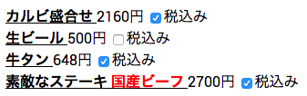

# polyjsx
polyjsxを使うとJavaScriptに\<polymer-element\>タグのJSXを書けるようになります。

JavaScript中のJSXが現れる場所に`/** @jsx polyjsx */`を与えることで、babelのJSX解釈のデフォルトである
`React.createElement()`の代わりに`polyjsx()`を用いることができます。

```javascript
/** @jsx polyjsx */
var message = '国産ビーフ';
var steak = (
    <price-tax price="2500" rate="8" switchable>
        素敵なステーキ
        <span style="color: red">{message}</span>
    </price-tax>
);

document.querySelector('body').appendChild(steak);
```

上記の内容をJSXを用いずに書くと以下のようになります。上記のJSXをbabelでトランスパイルして生成されるElementオブジェクトと、
以下のコードで得られる結果は同じものになります。
```javascript
var message = '国産ビーフ';
var steak = document.createElement('price-tax');
var msg = document.createElement('span');

msg.innerHTML = message;
msg.setAttribute('style', 'color: red');

Polymer.dom(steak).appendChild(document.createTextNode('素敵なステーキ'));
Polymer.dom(steak).appendChild(msg);
Polymer.dom(steak).setAttribute('price', 2500);
Polymer.dom(steak).setAttribute('rate', 8);
Polymer.dom(steak).setAttribute('switchable', true);

document.querySelector('body').appendChild(steak);
```

## Demo

デモ実行の準備として下記を実行します。
```
$ cd demo/
$ bower install
$ babel demo_es6.js > demo_es5.js
```

続いて、ディレクトリ polyjsx/ に移動して以下のコマンドを実行します。
```
$ python -m SimpleHTTPServer 8000
$ open http://localhost:8000/demo/index.html
```

メニューの末尾に`<price-tax>`タグが追加されている様子が確認できます。



## Articles
